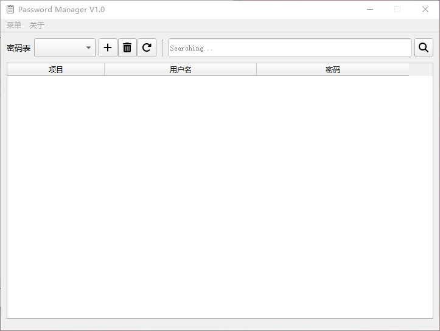
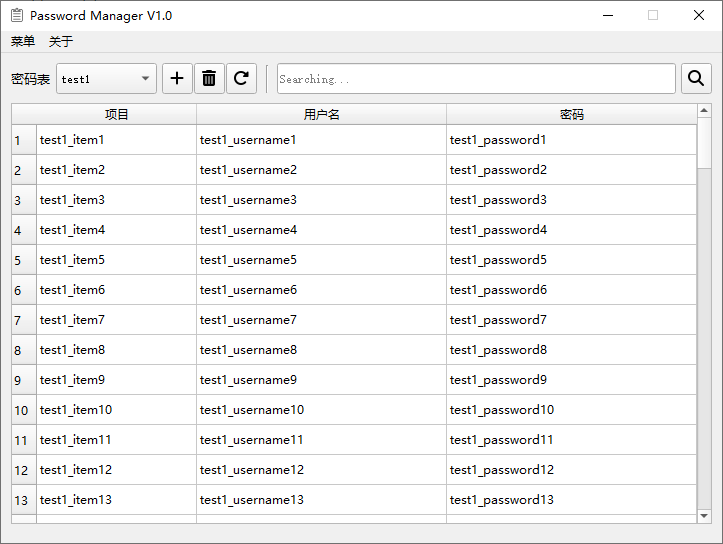
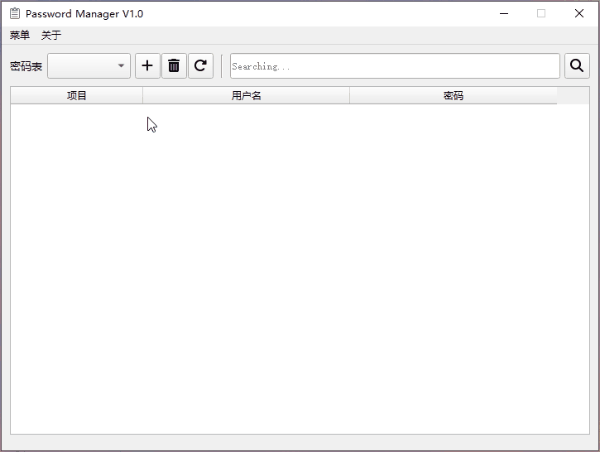
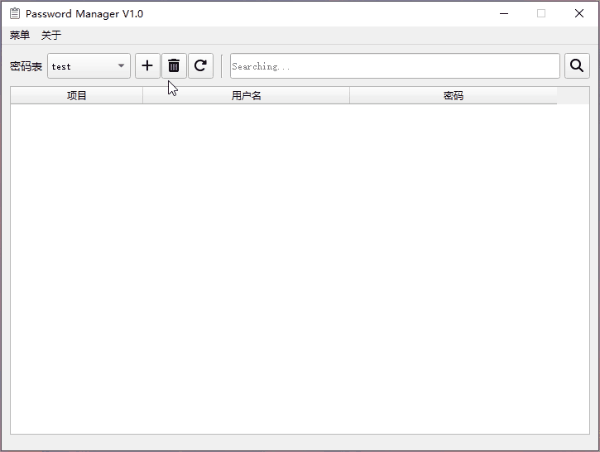
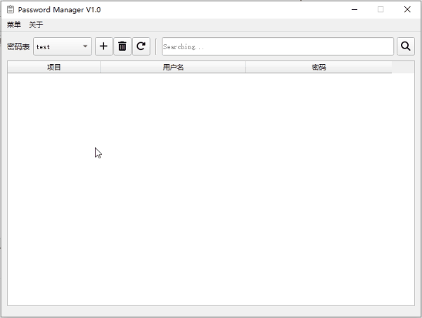
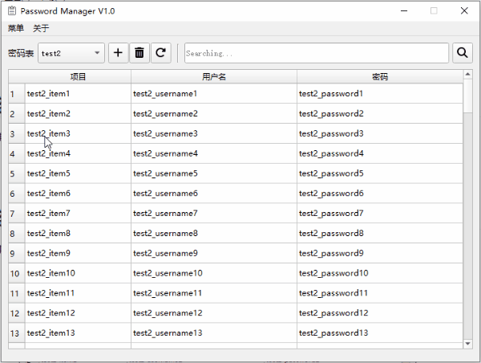
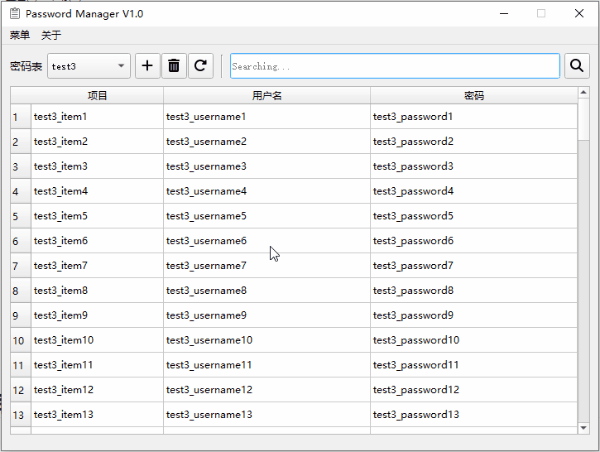
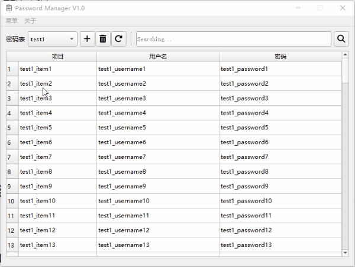

# Local Password Manager

A local password manager, small but useful.

# 支持功能

- [x] 新增密码表
- [ ] 删除密码表（还有一点问题）

- [x] 新增密码
- [x] 删除单个或多个密码
- [x] 更新密码
- [x] 根据关键词查询密码
- [x] 切换密码表

# 功能介绍

**整体界面：**

## 新增密码表

## 删除密码表

## 新增密码

在空白处或者表格单元格右键选择`Add Row`弹出`新增密码`的窗口。

## 删除密码

可以删除单行或者多行密码。

## 更新密码

选中一个单元格，通过`F2`或`回车`键进入编辑。

## 关键词查询

## 切换密码表

可通过下拉菜单选择其他密码表，或者通过鼠标滚轮滑动实现无缝切换。

## 清空单元格

# 使用须知

如果是用源码，`python`版本最好在`3.7.3`附近，另外需要安装如下库：

* pycryptodome == 3.16.0
* loguru == 0.6.0
* PyQt5 == 5.15.9

# Todo

- [ ] 导入密码表
- [ ] 导出密码表
- [ ] 优化删除密码表的功能
- [ ] 支持生成随机账号和密码
- [ ] 打包源码到exe